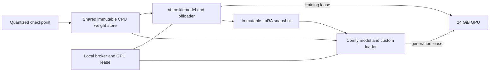

# Shared model memory between ai toolkit and ComfyUI

Plan a local shared-weight service and a self-contained `ComfyUI-AITK-SharedModels` custom-node package. Both applications retain their own model objects and execution engines, while their frozen CPU tensors refer to the same physical backing storage. Comfy runs its own conditioning, sampler, VAE and LoRA application. A cooperative GPU lease lets training pause in memory, Comfy render, and training resume without loading a second backbone.

Initial target: the non-distilled HunyuanImage 3 Instruct int8 ConvRot checkpoint on this 24 GiB GPU / 125.7 GiB RAM machine. This is a code implementation plan, not a deployed feature. Do not restart or migrate the current training job to implement it.

## Design decisions

| Concern | Decision |
|---|---|
| Shared data | One immutable CPU backing store for all frozen backbone weights and quantization metadata, including weights currently resident on the GPU. |
| Execution | Independent ai-toolkit and Comfy model objects. Comfy executes normal workflows locally. |
| GPU | One participating process owns the GPU at a time. CUDA allocations are process-local in the first implementation. |
| Mutable state | Training LoRA, gradients, optimizer, EMA, RNG, and Comfy patches/caches remain private. Export a small immutable adapter snapshot for Comfy. |
| Integration | Changes in this repository plus a separately installable Comfy custom-node package. No edits to Comfy core or Pedro's node pack. |
| Protocol | Versioned JSON metadata and Unix-domain socket file-descriptor passing. Do not pickle modules or exchange PyTorch internal storage objects across environments. |
| Scope | Instruct int8 first. Keep storage descriptors and variant selection reusable for W4A8 and Base; qualify those separately. |
| Performance promise | Eliminate the second CPU backbone and repeated checkpoint loading on handoff. Sampling throughput is measured separately; GPU weights still need staging after ownership changes. |



## What the local code requires

The inspected Comfy checkout is `30c8766b`; Pedro's Hunyuan package is `84ad3a3`. Local modifications and installed CUDA/Comfy Kitchen versions must also be recorded during qualification; Git revisions alone do not describe the complete runtime.

| Existing component | Reuse and required change |
|---|---|
| `toolkit/models/v2/diffusion_models/hunyuan_image_3.py` | Preserve streamed loading, variant validation and canonical expert mapping. Add a tensor-source interface backed by shared descriptors. |
| `toolkit/util/comfy_quant_import.py` | Reuse int8 ConvRot buffer construction. Require zero-copy attachment for shared tensors; reject unexpected dtype conversions or full-weight clones. |
| `toolkit/memory_management/manager_modules.py` | Preserve custom autograd, packed transfers, stream/event rings and backward staging. Replace `.pin_memory()` on shared buffers with shared registration or bounded staging. |
| `toolkit/memory_management/manager.py` | Add explicit reversible suspension and resumption. `memory_managed_to()` intentionally ignores ordinary moves away from the compute device. Existing detach/free paths can clone pinned buffers or destroy modules and are unsuitable for handoff. |
| `toolkit/models/v2/pool.py` | Continue process-local component reuse. Add a shared-store handle to a pool entry; the current pool itself does not share objects across processes. |
| `BaseSDTrainProcess` and `SDTrainer` | Reuse optimizer offload and normal training bookkeeping. Add a safe lease-yield point after a completed optimizer update and after scheduled sampling cleanup. |
| `toolkit/comfy_sample.py`, `toolkit/comfy_lora.py` | Reuse prompt submission, cancellation, output collection and adapter serialization where applicable. Add the Hunyuan shared-loader workflow and capability negotiation. |
| Pedro's `hunyuan_image_3/loader.py` | Reuse model definitions, variant constants, tokenizer and quantization semantics. A new loader builds from shared tensors instead of calling the disk loader. |
| Comfy `MoEExperts`, quantized operations and patcher APIs | Preserve Comfy inference kernels and bank-resident expert execution. Adapt CPU backing and pinning through package-owned operations/patcher classes. |
| Comfy execution lifecycle | Coordinate before any prompt GPU work and release in `finally`. Model-patcher callbacks alone do not cover preceding VAE/SigLIP operations. |

The trainer uses individual 2D expert linears; Comfy uses 3D expert banks. Store the original bank once and give the trainer expert-index views. Int8 scales, rotation metadata, biases and dense tensors need explicit mappings too. `contiguous()`, dtype conversions, Comfy flat packing and `.pin_memory()` are all potential hidden-copy sites and require pointer/offset checks.

## Shared storage and protocol

Create a small independently installable `aitk_shared_models` package, compatible with the existing Python 3.11 trainer and Python 3.12 Comfy environments. Keep its broker free of model imports and CUDA initialization. Each client uses its own PyTorch and CUDA runtime.

Proposed package layout:

```text
packages/aitk_shared_models/
  pyproject.toml
  aitk_shared_models/
    protocol.py          # messages, manifests, compatibility checks
    broker.py            # store ownership, clients, requests, GPU leases
    client.py            # UDS connection and descriptor receipt
    arena.py             # mappings, descriptors, ownership and cleanup
    registration.py      # CUDA host registration or bounded pinned staging
    snapshot.py          # immutable adapter generations
    diagnostics.py       # byte accounting and phase timings
```

Expose APIs such as `open_store(identity)`, `tensor(name, slice_spec)`, `acquire_gpu(device_uuid, request_id)`, `ack_quiescent(lease_epoch)`, `publish_adapter(step, metadata)` and `release_client()`. These are proposed interfaces; they must not become public until the storage prototype passes.

The manifest contains protocol/layout versions, arena UUID, content digest, source provenance, variant/config digest, quantization format and parameters, and a table of tensor names, dtypes, shapes, byte offsets, strides, lengths and aliases. Store quantization markers as validated JSON metadata. Specify endianness and alignment. Validate every extent before constructing views.

Use checkpoint content identity for deduplication, with path/stat information as a fast lookup and provenance check. The existing `/d` symlink and `/e` target identify the same contents. Do not silently change the existing training adapter resume identity rules; maintain a distinct stable store identity and an explicit compatibility check.

Clients map descriptors from a broker-owned file descriptor, so a client exit does not invalidate the remaining mappings. Use owner-only socket permissions and peer credentials. Defaults belong under `$XDG_RUNTIME_DIR/aitk-shared-models`; this is local IPC, not a network generation service. Protocol messages carry descriptors, IDs and small metadata, never an 80 GiB serialized state dict.

### Backing storage choice

Prototype a sealed `memfd` arena first, with a file-backed read-only arena on a suitable local filesystem as the fallback. `/dev/shm` is 63 GiB on this machine, so a named segment placed there cannot hold the 76.16 GiB int8 file. `memfd` has separate allocation/lifetime behavior; verify actual memory/cgroup limits and allocation failures rather than assuming it can fit. Linux documents `memfd_create` and its sealing/lifetime behavior in the [system call reference](https://man7.org/linux/man-pages/man2/memfd_create.2.html).

Construct the arena during the next shared-mode model load, before creating private pinned copies. Read bounded chunks directly into the destination; do not first materialize an entire ordinary model and then copy it. Drop builder/source mappings as ranges finish. Publish `READY` only after all tensors and metadata are validated, writable builder mappings are removed, and the read-only policy is installed. On interruption discard the incomplete generation. Do not attempt to publish the current running process's private allocations in place.

Prefer tensor layouts that are views in both runtimes. If Comfy's flat representation requires alignment or packing, perform that normalization once in the common arena and expose the trainer's slices from it. Avoid keeping separate complete checkpoint-layout and Comfy-layout arenas. Small metadata conversions are acceptable and must be counted.

### Pinning without duplicate weights

`torch.from_file` does not directly create pinned mapped tensors; mapping plus `.pin_memory()` would reintroduce a copy. [PyTorch 2.7 documents this limitation](https://docs.pytorch.org/docs/2.7/generated/torch.from_file.html).

Register existing, aligned mapped ranges with `cudaHostRegister`, through an owner object that tracks registration coverage and pending transfers. Each process must establish and validate registration for its own mapping; do not assume one process's virtual address or registration is usable in another. Deduplicate overlapping bank/expert ranges. Register only the budgeted transfer ranges, and unregister only after all transfer events complete. CUDA documents registration, read-only capability checks and unregister requirements in the [CUDA 12.6 runtime API](https://docs.nvidia.com/cuda/archive/12.6.3/cuda-runtime-api/group__CUDART__MEMORY.html).

Read-only registration is a mandatory capability probe, including CPU-read-only mapping support. The mapping wrapper must expose read views safely to PyTorch without pretending a read-only Python buffer is writable. If that combination is unsupported, keep the immutable shared mapping and copy bounded chunks through two private pinned staging buffers, initially capped at 256 MiB each. Never silently fall back to pinning a complete private backbone. Measure the fallback's extra host-copy cost before selecting it by default.

Comfy's installed `pinned_memory.py` allocates its own host buffers and tracks registration/budget state. The extension must bypass that allocation for shared weights through package-owned operations/patcher behavior. Reusing ordinary loader output and adding a flag afterward is insufficient. Preserve Comfy's GPU staging, quantized matmul and lookahead behavior where the shared backing can satisfy their contracts. Treat AIMDO/dynamic-patcher support as a measured compatibility gate; use a package-owned compatible patcher if required, and report any throughput loss.

## ai toolkit changes

1. Add `model.shared_weights` configuration, off by default, carrying socket/store identity and strict attachment policy. Validate frozen-base LoRA mode, local device identity and supported quantization before loading. Full fine-tuning and base-weight merge/requantization cannot write into the immutable arena.
2. Add a `TensorSource` abstraction to the Hunyuan streamed loader. The ordinary checkpoint reader remains the default; shared mode returns bank/dense tensor views and reuses canonical key mapping and format checks. A sidecar ownership registry tracks arena ranges independently of Tensor attributes, which views and `Parameter` wrapping may discard.
3. Teach the memory manager to preserve shared CPU backing when attaching managed layers, uploading resident layers, parking and freeing. Retain a shared CPU master descriptor even for GPU-resident frozen tensors. Suspension rebinds those tensors to their existing CPU views instead of copying GPU weights back to new CPU allocations.
4. Implement `suspend_for_external_gpu()` / `resume_from_external_gpu()` with an explicit state machine. Drain forward/backward transfer streams, finish autograd work, clear temporary staging references, park LoRA/optimizer/EMA and auxiliary models, release GPU-resident frozen copies, then return allocator caches. Restore the same selected resident modules and offload fraction afterward; do not rerandomize placement.
5. Poll lease requests at verified safe points. Yield only after successful optimizer/EMA bookkeeping, gradient clearing and graph release, with no unfinished gradient accumulation. `end_step_hook()` alone is not proof of an optimizer boundary. Do not consume another dataset item, advance the LR scheduler, reset RNG or increment the step while waiting. If a request arrives during a native sample, finish that sampling session before yielding.
6. Keep the job alive and resumable in memory. Use UI status `running` with a clear `Waiting for ComfyUI` phase, or update every queue occupancy query if adding a new DB status. Otherwise the queue worker could start a second training job. Stop/cancel must remain responsive during the wait.
7. Extend the Hunyuan preflight's current Comfy-preview rejection only for a negotiated shared-memory provider. Keep rejecting the ordinary two-backbone path. Scheduled previews can publish an adapter snapshot, yield, submit an existing-style Comfy workflow, collect results, and reacquire the GPU without reloading the backbone.

Preserve all applicable current optimizations: packed int8 weights and activation quantization, CPU expert offload, resident-layer selection, asynchronous stream/event staging, backward support, gradient checkpointing, 8-bit optimizer, latent/reference caches, zero-worker mode, CPU embedding lookup, encoder destruction/reload, no-grad tiled VAE, sequential CFG option and exception-safe state restoration. Shared mode replaces weight ownership, not these compute paths.

## Comfy custom node package

Develop the package inside this repository for review, then install it as a separate directory under Comfy's `custom_nodes` when implementation is complete. The package depends on the installed Pedro Hunyuan node pack and uses its definitions through a verified adapter. No patched copies of Comfy or Pedro source files are required.

```text
integrations/ComfyUI-AITK-SharedModels/
  __init__.py             # ComfyExtension and comfy_entrypoint
  pyproject.toml
  nodes.py                # loader, adapter snapshot, status
  hunyuan_adapter.py     # build Pedro model from descriptor views
  shared_ops.py          # shared CPU storage and staging behavior
  shared_patcher.py      # clone, patch, residency and teardown ownership
  execution_lease.py     # whole-prompt GPU lease and cleanup
  compatibility.py      # explicit supported API/layout checks
  README.md
  workflows/hunyuan_instruct_shared_edit.json
```

| Proposed node | Interface and behavior |
|---|---|
| `AITKSharedHunyuanImage3Loader` | Select a registered model/store and socket. Return standard `MODEL`. Attach shared views; no second checkpoint read, checkpoint conversion or full CPU copy. |
| `AITKSharedLoRASnapshot` | Take `MODEL`, trainer/job or immutable snapshot ID, and strength. Return a cloned standard `MODEL` with a private factorized adapter and a snapshot-generation report. |
| `AITKSharedModelStatus` | Report store identity, attached processes, CPU shared/private bytes, GPU owner, pending handoff and snapshot step. CPU-only. |

Reuse Pedro's edit/text encoders, resolution/latent nodes, VAE loader, existing sampler nodes and output nodes. Initially share the large backbone; VAE/SigLIP have separate identities and can be added to the same store later if their private memory is material. Their GPU work participates in the lease from the first version.

The shared loader must build on meta/empty modules and bind tensors without allocating a full initialized model. Reuse variant/config/tokenizer semantics, Comfy quantization layout constructors and real `ModelPatcher` contracts. Verify every base tensor remains an arena view after construction, quantized wrapping and cloning. Keep original compute dtypes; mapping the same bytes does not require identical execution precision in both engines.

LoRA application must not merge patches into shared CPU weights. Reuse the existing Hunyuan canonical adapter mapping and Comfy's factorized patch support where it keeps the base immutable. If a Comfy patch operation needs mutable weights, provide private bounded GPU temporaries or reject that operation in shared mode. Cover clone, unpatch, unload, dtype conversion and deep-clone callbacks; first release explicitly supports one GPU and rejects unsupported multi-GPU clones rather than falling back to a disk reload.

### Whole prompt lease

Acquire ownership before model loading, VAE encoding, vision conditioning or sampling can allocate GPU memory. A sampler-only wrapper is too late for edit workflows. Also, a loader node may be cached and therefore cannot serve as the only acquisition point.

Implement one extension-owned prompt-execution boundary. Prefer a supported execution hook if it provides a blocking before phase and guaranteed `finally` cleanup. The inspected cache-provider lifecycle catches callback errors, so it cannot by itself enforce GPU exclusion. If no adequate public hook exists, use a narrowly version-checked, reversible wrapper around `PromptExecutor.execute_async`, installed by the mod; retain and call the original implementation, avoid duplicate wrapping, and reject incompatible signatures. This changes runtime behavior within the extension without editing core files.

While coordination is enabled, gate all Comfy prompt execution, including workflows without the shared loader, so a normal VAE or unrelated model cannot start alongside training. CPU-only exemptions can be added later with a reliable capability classification. Acquire in the execution worker, not in the HTTP prompt-submission handler. Cancellation remains responsive while waiting.

Hold a reentrant lease for the entire prompt, through decode and cleanup. In `finally`, synchronize outstanding GPU streams; offload all Comfy models used in that prompt, including VAE/vision and cached patcher clones; discard GPU staging/lookahead buffers; return allocator caches; acknowledge quiescence. Cached CPU graph outputs and shared mappings can remain. Verify global Comfy loaded-model bookkeeping agrees with the extension's release. Model callbacks remain useful for cloning and lifetime management but are not the sole lease guard.

## Handoff, snapshots and failure handling

State progression: `TRAINING -> YIELD_REQUESTED -> TRAINER_QUIESCENT -> COMFY_ACTIVE -> COMFY_QUIESCENT -> TRAINING`. Loading/caching/native sampling also require ownership. Track GPU UUID, client PID plus process-start identity, request ID and monotonically increasing lease epoch.

For a training preview:

1. Complete the optimizer boundary and atomically publish the current LoRA factors plus variant/base identity, rank, alpha, target preset, step and content hash. Use existing safetensors export and an atomic rename; snapshot volume is small relative to the base.
2. Park the trainer and acknowledge released GPU allocations. Leave optimizer/RNG/data position intact.
3. Submit the Comfy prompt with an explicit immutable snapshot ID. Broker grants the matching request; avoid deadlock by releasing the trainer lease before waiting for prompt completion.
4. Comfy attaches the shared backbone, applies the private snapshot, encodes references and renders locally. Standard Comfy progress/output handling remains available.
5. On success, failure or cancellation, Comfy releases GPU ownership in `finally`. Only then does the trainer restore residency and continue.

Interactive Comfy requests follow the same boundary protocol. Resolve `latest` snapshots once per execution and include the generation/hash in Comfy cache invalidation; unchanged loader objects must not accidentally reuse an old LoRA. Pin that snapshot for the entire prompt. Bound outstanding snapshots and delete them only after references are released.

A timeout requests cancellation; it never proves the previous GPU owner has stopped. Do not grant concurrent ownership based solely on a missed heartbeat. On client death, verify process identity and CUDA resource release before reassignment. Broker failure leaves surviving clients quiescent at safe boundaries until ownership can be re-established; existing arena mappings remain alive via their descriptors. No automatic process killing is part of the normal protocol.

Guard store creation against simultaneous cold starts. A second client waits for `READY` or receives the builder's error instead of loading independently. Releasing one client decrements its ownership only; it cannot unlink a store still used by another client. Preserve all mappings until tensor views and outstanding transfers have finished. Never unregister another owner's active range or silently build a second full store on an attachment error.

## Memory and performance acceptance

The shared CPU master is approximately the 76.16 GiB checkpoint payload plus alignment/metadata. Keeping CPU backing for GPU-resident layers can increase ai-toolkit's CPU footprint relative to its current partial-offload layout. Count that explicitly; this design does not imply the combined process footprints equal the trainer's present RSS.

Track machine `MemAvailable`, aggregate proportional set size, per-process private bytes, shared-store committed/resident bytes, registered ranges, staging buffers and driver VRAM. Do not sum RSS as if shared pages were separate physical copies. Include both CUDA contexts and auxiliary encoders in the GPU/host budgets.

Initial acceptance targets, subject to measurements:

- Attaching an idle second backbone adds no model-sized private allocation; target less than 1 GiB private attachment overhead excluding separately loaded VAE/SigLIP.
- Maintain at least 12 GiB machine `MemAvailable` during the qualified workload and about 1 GiB GPU headroom where achievable. Enforce a preflight budget; never silently OOM or clone the model to satisfy a pinning call.
- Bounded staging fallback uses at most 512 MiB of additional pinned buffers per active owner, apart from explicitly accounted auxiliary components.
- Warm handoff performs zero backbone checkpoint reads, conversions or full-model D2H copies. Resident-set H2D staging is expected and timed.
- Comfy rendering approaches the ordinary Comfy loader's speed at identical model, LoRA, reference, seed, resolution, CFG, step count and patcher settings. Record lost AIMDO/lookahead optimizations explicitly. A large regression fails qualification even if sharing works.
- Training warm-step time, finite/nonzero adapter gradients and sample quality remain within the measured baseline's expected behavior. Pause/resume preserves the optimizer and data sequence; compare against a controlled uninterrupted run.

## Implementation order and tests

| Stage | Concrete deliverable | Exit evidence |
|---|---|---|
| 1. Cross-environment storage spike | Small descriptor-backed int8 bank, scales and dense tensor in the actual two Python environments; no full model | Physical sharing/PSS, pointer-offset aliasing within each process, read-only protection, registration or bounded fallback, asynchronous H2D correctness, importer exit/restart. Do not compare raw virtual pointers across processes. |
| 2. Broker and arena lifecycle | Versioned manifest, bounded builder, UDS descriptor transfer and client references | Concurrent cold-start, partial-load failure, incompatible metadata, out-of-bounds rejection, owner/client crashes, source identity and cleanup tests. |
| 3. Trainer storage and suspension | Shared H3 reader, memory-manager hooks, explicit park/resume, safe optimizer boundary | Tiny training fixture with accumulated gradients, snapshot export, RNG/data/optimizer preservation, injected exception cleanup; quantized base bytes unchanged. |
| 4. Comfy mod | V3 custom loader, shared operations/patcher, LoRA snapshot node, whole-prompt lease | Standard `MODEL` workflow renders locally; cached loaders and LoRA clones retain ownership; no full private pin/flat-pack copy; cancellation/decode failure releases the lease. |
| 5. Real Instruct int8 handoff | Exact existing checkpoint and lineart edit workload, run between training jobs | Baseline ordinary Comfy timing, shared Comfy timing, trainer -> Comfy -> trainer cycles, peak physical RAM/VRAM, no warm checkpoint reads, nonzero adapter effect and zero-strength agreement within the same Comfy backend. |
| 6. Scheduled samples and UI | Shared Comfy provider/template, status display and cancellation | Samples appear in normal ai-toolkit output/UI, schedule works across multiple cycles, queue does not start a second job during a wait, latest snapshot never stays stale. |
| 7. Additional formats | W4A8 metadata/codebook views and Base variant | Same storage tests and real-format qualification. Base uses its own model identity and sampling contract. |

The first spike is the decision gate: demonstrate shared registration/layout compatibility before implementing the full broker/UI. Perform GPU experiments and full-model tests between authorized runs; code review and CPU protocol fixtures can proceed while the present run continues.

No generic CUDA IPC sharing is needed for this first release. It would only share the currently resident GPU subset and adds allocation-lifetime, stream and allocator constraints. Consider it separately after measuring warm handoff costs; the CPU store solves the full-backbone duplication problem first.

## Completion criteria

Two independent processes can retain the same Hunyuan backbone using one CPU backing store. A normal Comfy edit workflow can borrow the GPU, render with a chosen training adapter snapshot, release it on every exit path, and let the existing training process continue without losing an update or rereading the backbone. All Comfy integration ships in the custom-node mod, and the ordinary ai-toolkit/Comfy paths remain available when shared mode is disabled.
